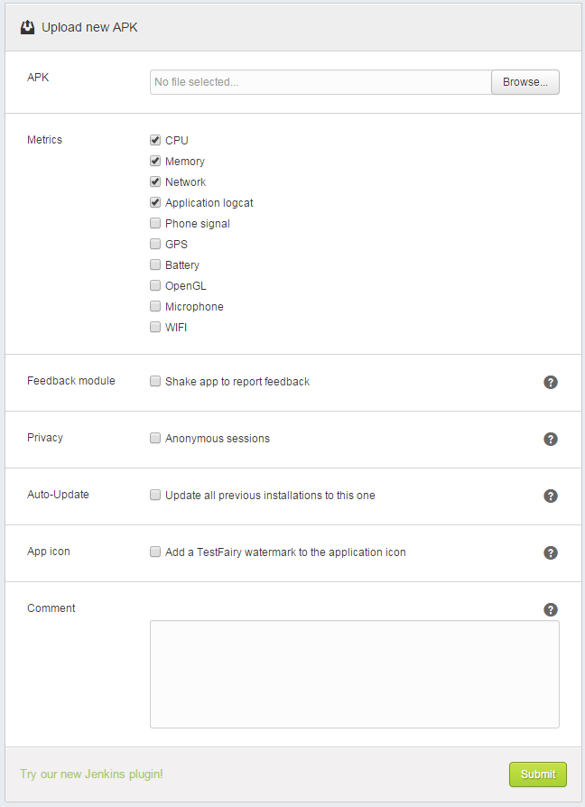
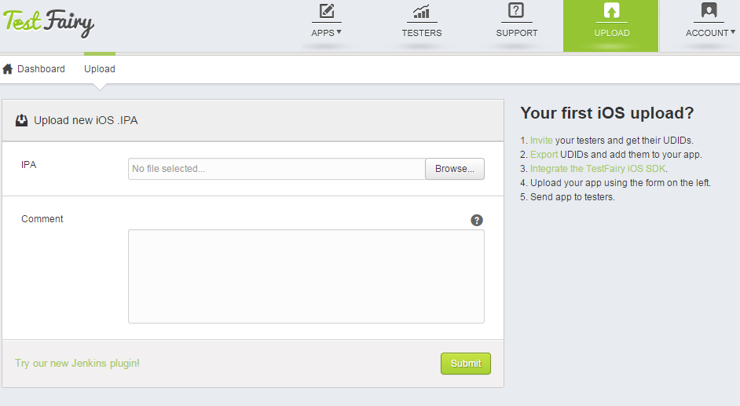

If you don’t have an account yet, please <a href="http://www.testfairy.com/signup" target="_blank">sign up</a>. It is easy and it is free !
If you have a TestFairy account, please  <a href="https://app.testfairy.com/login" target="_blank">log in</a>.

##  Uploading Your Application

Once your account is created and verified, you are ready to upload your app.

Upload is as simple as it sounds, just click on the  **Upload** button on the upper menu, choose your OS and your’re done.

Please note that in some situations you might prefer our <a href="http://docs.testfairy.com/Upload_API.html">Upload API</a> and use our <a href="https://wiki.jenkins-ci.org/display/JENKINS/TestFairy+Plugin">Jenkins plugin</a>, <a href="#">Gradle plugin</a>, or <a href="https://github.com/testfairy/command-line-uploader" target="_blank">Command line uploader</a>. 
On Android (this is not relevant for iOS), when you upload your app via the web interface, we re-sign the app with our certificate. If your app uses 3rd party APIs such as Google In App Billing, Google Maps, Facebook connect and such, those services may not like our signature. For those cases where your signature is required, our command line uploader will upload your app, wait for it to be instrumented, get it back, sign it with your signature, and re-upload it to our server. If you are using Jenkins or any other continuous integration platform, our [Jenkins plugin](https://wiki.jenkins-ci.org/display/JENKINS/TestFairy+Plugin) can be a perfect match.

The code of our command line uploader, Jenkins and Gradle plugins is open source. Feel free to change it to make it better.

This guide, as we mentioned above, will continue describing the manual uploads.

## Selecting Your Project Settings

You can define your test settings right from the upload page.

**Selecting Your Project Settings - Android APK.**

Here are the parameters you can set up from the **Upload** page.
Additional settings can be configured from the <a href="http://docs.testfairy.com/Getting_Started/Account_Settings.html">Project Settings</a> page.

 * CPU
 * Memory
 * Network
 * Application logcat
 * Phone signal
 * GPS
 * Battery
 * OpenGL
 * Microphone
 * WIFI

In addition, you can set the following parameters:

-- **Anonymous sessions** - Determines whether to record the user’s email address, from their Android accounts settings. 

-- **Auto-Update** - When auto update is enabled, users using previous versions of this app will get a notification about the new version next time they use the app. Download of the new version will start immediately, the user will not have to actively download it. Note that in this case no email will be sent to the testers.

-- **Comment** - add any comments you would like your testers to receive in the update email

**Selecting Your Project Settings - iOS IPA.**

Here are the parameters you can set up from the **Upload** page.
Additional settings can be configured from the <a href="http://docs.testfairy.com/Getting_Started/Account_Settings.html">Project Settings</a> page.

 * CPU
 * Memory
 * Application logs
 

**What to read next:** [How To Invite Testers](How_To_Invite_Testers.html).
