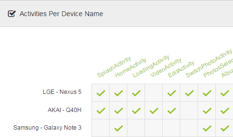
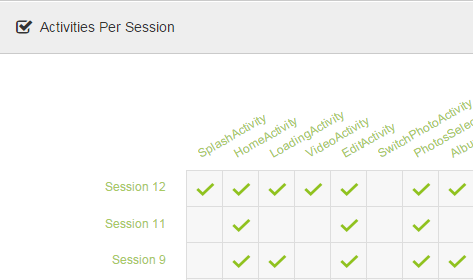
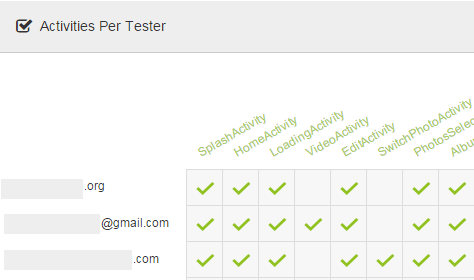
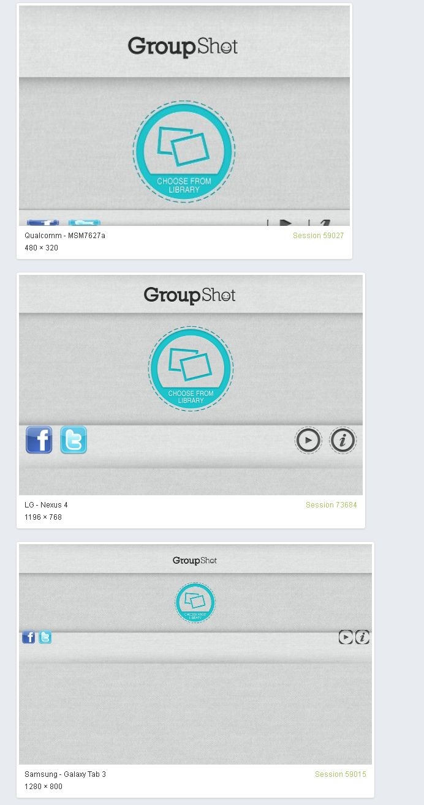
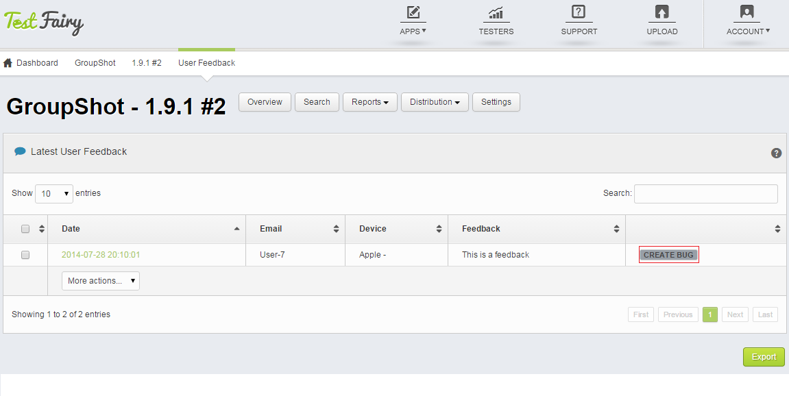

<!--# Reports-->

The reports section offers you a comprehensive numeric and visual analysis of all your tests, across devices, users and sessions. Use a bird-eye **overview** or drill down to a particular session for more details.
You can access the reports menu from the build screen. To arrive at the **build screen**,  select you **application** from the **Apps** button on the top panel, then select the **build** from the **builds** table of your application. 

 
<!--  -->

## Coverage Reports

If you have wondered how thorough your testing is, this page can help you understand exactly that. The following tables show the coverage of your tests. The columns are your **app activities and fragments**, and the rows are the **devices**, **sessions** and **users** that participated in this project testing. This info will help you verify that your testers went through all the app's activities or fragments and in case they did not, you will easily understand where and what should be improved. 

**Activities per Device Name**

Click on each individual activity/fragment to drill down to a [detailed visual report](#visual_analysis) of this activity. 

Note that this report is particularly crucial for your testing efforts - as you can see in the screenshot below, this application was not tested thoroughly on Samsung! Your tester might report you that there were no crashes on a particular device, but in this graph you can see that the reason there were no crashes might be that most of the activities were not even performed on this device.

 

**Activities per Session**

Click on a specific session to drill down into a <a href="http://docs.testfairy.com/Getting_Started/How-To-Analyze-Test-Results.html">detailed session analysis</a>. 

 

**Activities per Tester**

Click on each individual activity/fragment to drill down to a [detailed visual report](#visual_analysis) of this activity.

 

**Checkpoints** 

Checkpoints are used to provide insight regarding the way your testers use your apps.
These can help you monitor when a tester has reached key points in your app, such as or visiting the in-app store.
A checkpoint is a string written to log with the tag **testfairy-checkpoint**.

Please consult our <a href="http://docs.testfairy.com/Advanced/Checkpoints.html" target="_blank">API documentation</a> for more details on checkpoints.

 
	

	
##  Visual Analysis
	
Want to see with your own eyes how different activities and fragments look on different devices? This report is for you! 
Just choose the activity you want to analyse and see screenshots across different devices.

Note that visual analysis  is only available for our startup and enterprise customers.

<!--  -->
 

## Statistics 

All the statistics you need are gathered on one useful page. 

**Performance Statistics**

Want to analyse the CPU and memory performance as well as thread counts across different devices?

Look at the **Performance Statistics** report.

<!--  -->
 
 
**Tester Statistics**

Want to know how many times each of your testers used your app and for how long?

The  **Tester Statistics** report is for you.
		 

		
**Device Statistics**

Want to analyse the amount and duration of sessions on different devices?
Use the **Device Statistics** report.

<!--  -->

 
## User Feedback

It is real easy to get instant feedback from your testers without adding any new buttons to your app. All your testers need to do to access a feedback window is shake their device at any given moment. You can see their input instantly and open new relevant issues directly in your bug system from this report:  

<!--  -->

**What to read next:**  [Build Settings](Build_Settings.html)
 
