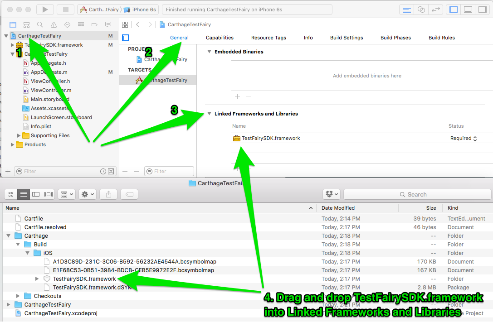
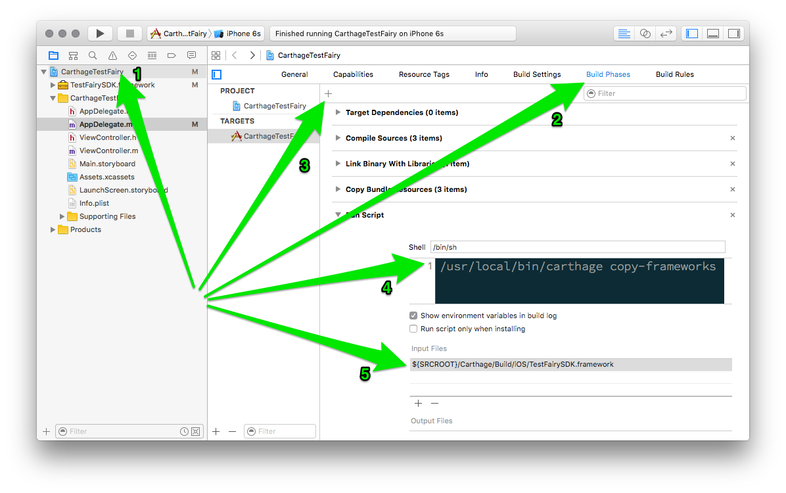

## Adding TestFairy to your Cartfile

Once you have Carthage installed, you can begin adding frameworks to your project. Note that Carthage only supports dynamic frameworks, which are **only available on iOS 8 or later** (or any version of OS X).

1. Add `github "testfairy/testfairy-carthage"` to your Cartfile.
1. Run `carthage update`. 
1. On your application targets’ “General” settings tab, in the “Linked Frameworks and Libraries” section, drag and drop the TestFairy framework from the [Carthage/Build][] folder on disk.



1. On your application targets’ “Build Phases” settings tab, click the “+” icon and choose “New Run Script Phase”. Create a Run Script in which you specify your shell (ex: `bin/sh`), add the following contents to the script area below the shell:

  ```sh
  /usr/local/bin/carthage copy-frameworks
  ```

  and add the paths to the TestFairySDK frameworks under “Input Files”, e.g.:

  ```
  ${SRCROOT}/Carthage/Build/iOS/TestFairySDK.framework
  ```



## Include TestFairy

* Open your **AppDelegate.m** file.
    
* Add this line to your *imports* section:
`#import <TestFairySDK/TestFairySDK.h>`
    
* Locate `application:didFinishLaunchingWithOptions:` method and add a call using the *App Token* from your [Account Settings page](https://app.testfairy.com/settings#apptoken).
```
- (BOOL)application:(UIApplication *)application didFinishLaunchingWithOptions:(NSDictionary *)launchOptions {
	// Override point for customization after application launch.
	[TestFairy begin:<App token from https://app.testfairy.com/settings#apptoken>];
	return YES;
}
```
